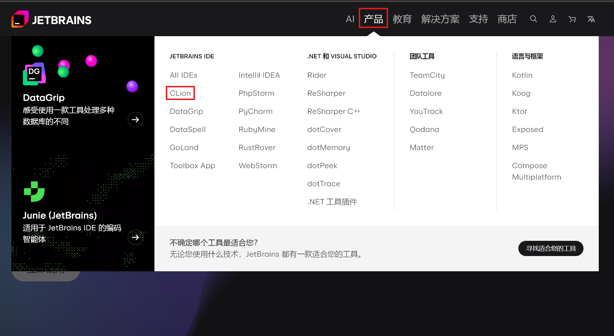
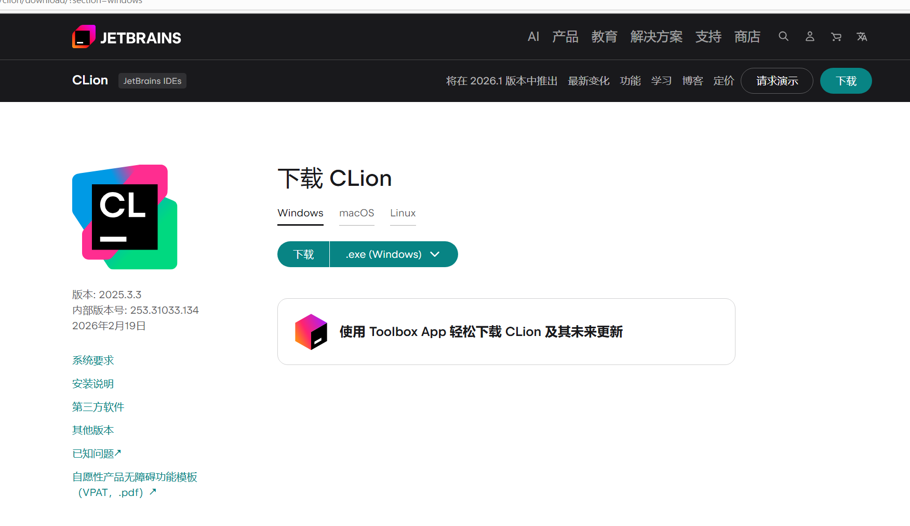

# 补充内容
相信看到这里的，估计被校园网下载visual studio逼疯了，那么我们换个思路下载另外一个开发工具会好点呢？
## 使用Clion 创建第一个项目
### 1、下载Clion
在浏览器中使用搜索引擎搜索「JetBrains」（也可以[点击此处](https://www.jetbrains.com.cn/)直接访问其官方网站）

依次选择「产品」、「Clion」进入CLion官网（也可以[点击此处](https://www.jetbrains.com.cn/clion/)直接访问其官方网站）

点击「下载」访问其下载页面（也可以[点击此处](https://www.jetbrains.com.cn/clion/download/)直接访问下载页面）

你是高阶玩家？可以直接[点击此处](https://download.jetbrains.com/cpp/CLion-2025.3.3.exe)直接下载安装包

安装过程请按照程序提示操作。

## 创建第一个项目
如果在安装CLion时选择了「在桌面创建快捷方式」选项，现在可以直接在桌面打开

初次打开CLion会有一系列的向导，请按教程操作

