# 补充内容
相信看到这里的，估计被校园网下载visual studio逼疯了，那么我们换个思路下载另外一个开发工具会好点呢？
## 使用Clion 创建第一个项目
### 1、下载Clion
在浏览器中使用搜索引擎搜索「JetBrains」（也可以[点击此处](https://www.jetbrains.com.cn/)直接访问其官方网站）

依次选择「产品」、「Clion」进入CLion官网（也可以[点击此处](https://www.jetbrains.com.cn/clion/)直接访问其官方网站）

点击「下载」访问其下载页面（也可以[点击此处](https://www.jetbrains.com.cn/clion/download/)直接访问下载页面）

你是高阶玩家？可以直接[点击此处](https://download.jetbrains.com/cpp/CLion-2025.3.3.exe)直接下载安装包

安装过程请按照程序提示操作。

## 创建第一个项目
如果在安装CLion时选择了「在桌面创建快捷方式」选项，现在可以直接在桌面打开

初次打开CLion会有一系列的向导，请按教程操作。

首先会要求你同意数据共享（如果你选择使用除教育用途外的“非商业用途”那该选项为必选）
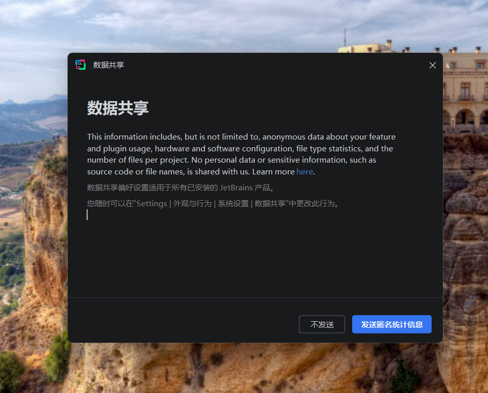

点击右下角设置，选择「Region and Language Settings... 」，更改语言和地区
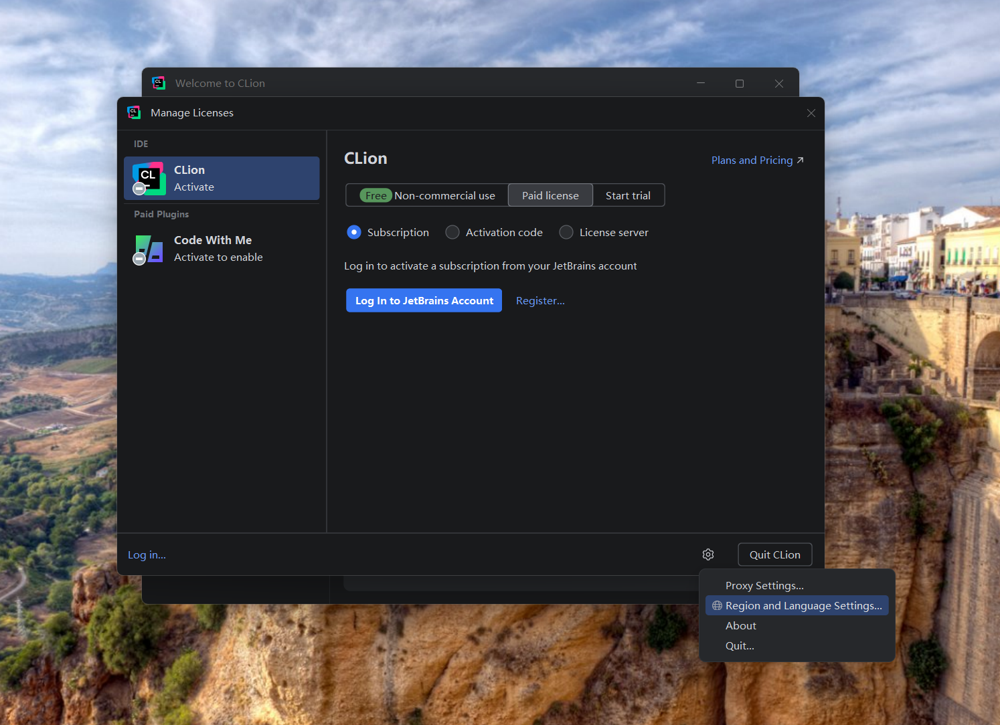

调整语言和地区到如图所示

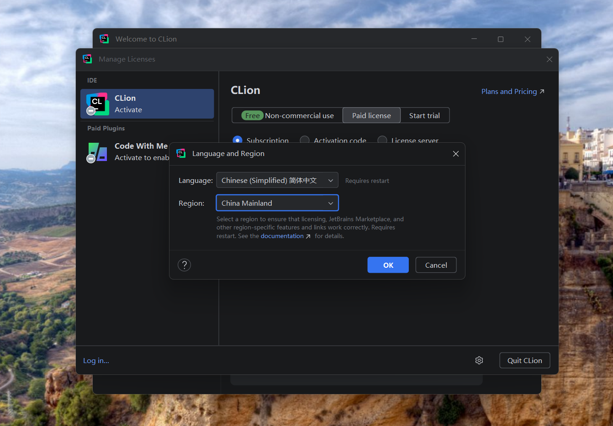

重新启动IDE，并登陆JetBrains账号（账号注册地址[请点此处](ttps://account.jetbrains.com/signup)）
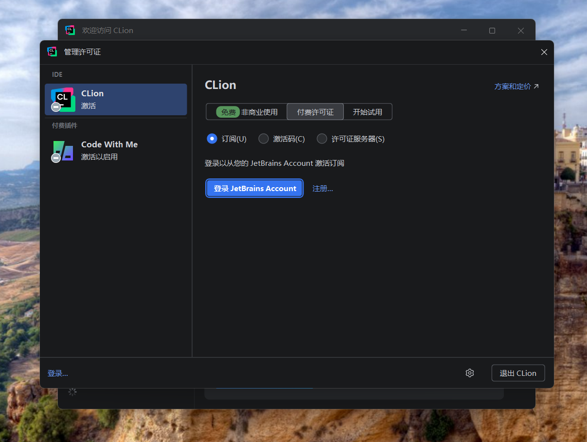

登陆账号后选择一个许可证（学生可以选择使用**教育用途**，免费使用JetBrains所有IDE软件，详情请看后文介绍。）
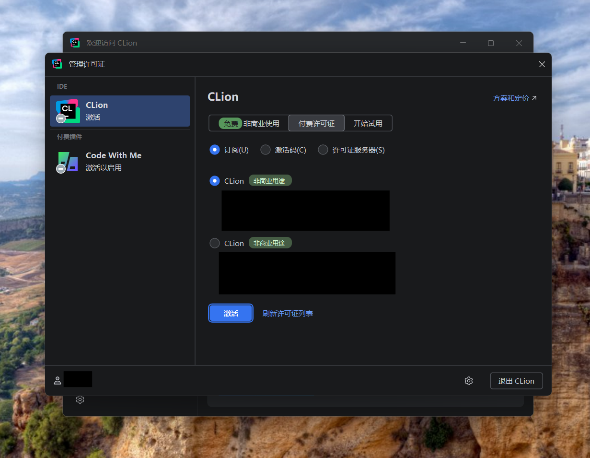

## 创建第一个C项目-- Hello World
第一步，点击新建项目

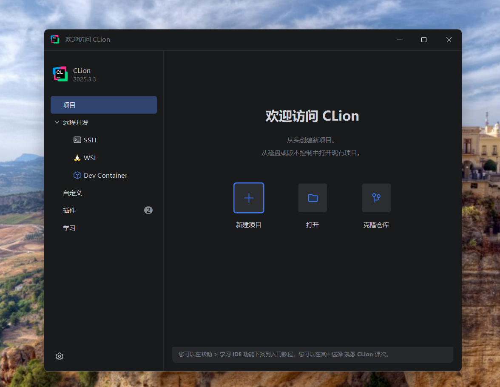

选择「C可执行文件」

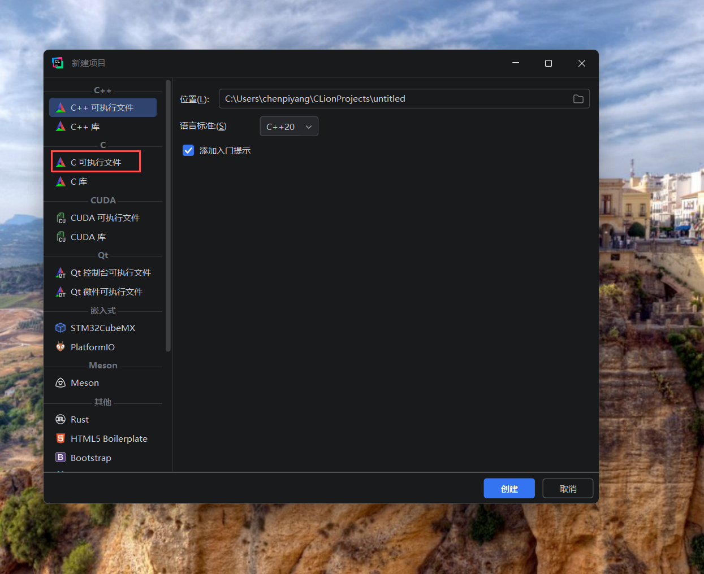

然后选择项目的保存位置

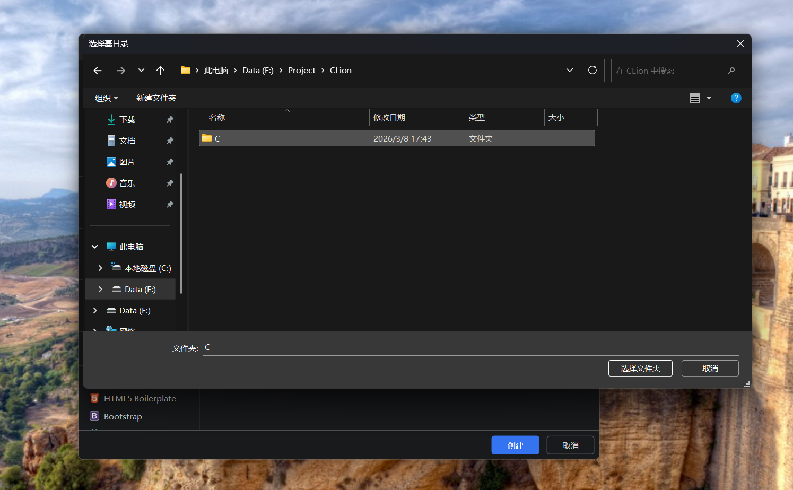

然后将会打开CLion的主界面主界面已经提供了hello world的程序

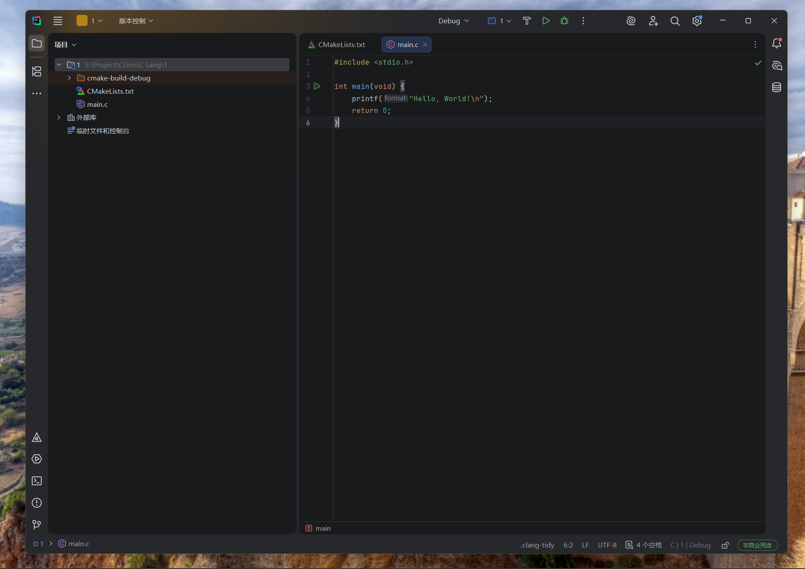

## 学生免费使用JetBrains所有IDE软件操作教程
注意：为避免滥用学生权益，申请此类型“非商业用途许可”需要学信网验证。

访问JetBrains官网，选择「教育」→免费许可证下的「面向学生」访问申请页面（或者直接[点击此处](https://www.jetbrains.com.cn/academy/student-pack/)访问申请链接）

按照网站要求填写相关信息（个人真实信息）（表格填写地址[点击此处](https://www.jetbrains.com/shop/eform/students)）

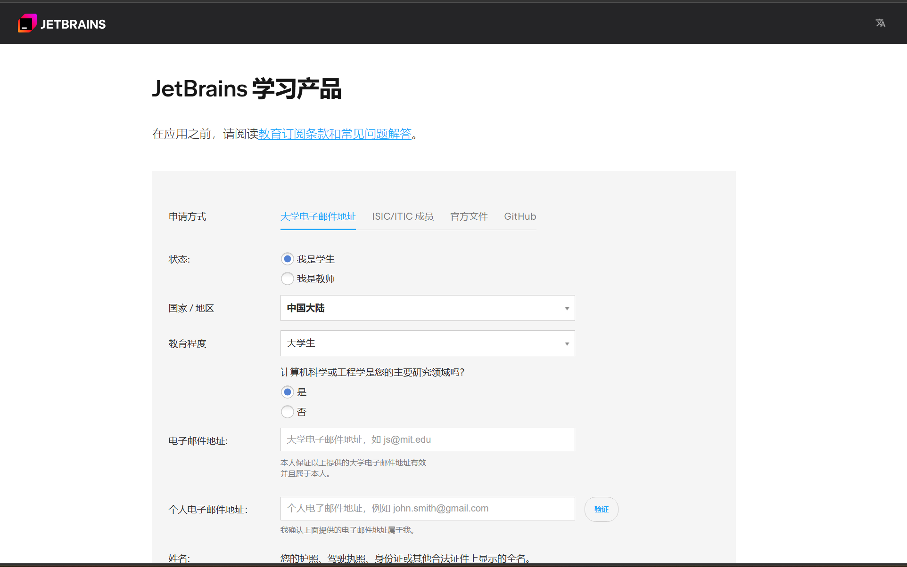

（如果你的学校比较“抠门”没有向你提供邮箱地址（以@edu.cn结尾），你需要选择官方文件（学信网认证报告）来进行验证）

提示：

1、电子邮件地址为自己常用的邮箱地址

2、人工审查需要的时间较长，推荐选择长一些的报告有效期。（关于中国高等教育学生信息网（学信网）学籍在线验证报告的“申请”，可以[点击此处](https://www.chsi.com.cn/)快速访问）

3、申请必须使用个人**真实姓名**

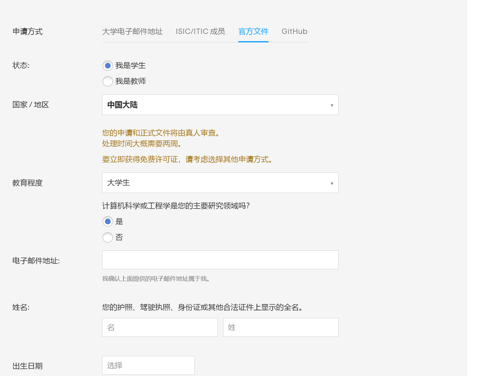
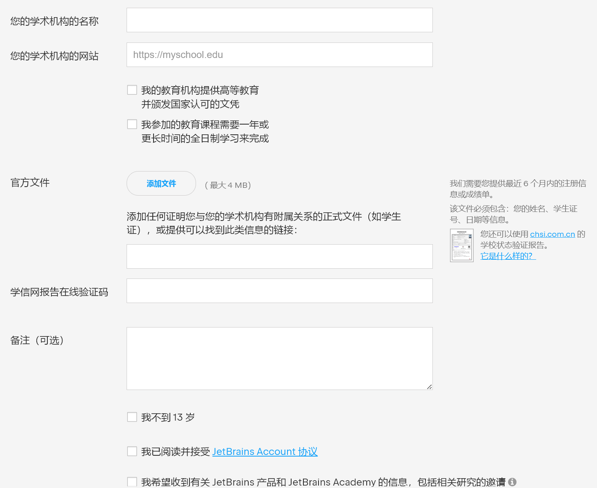